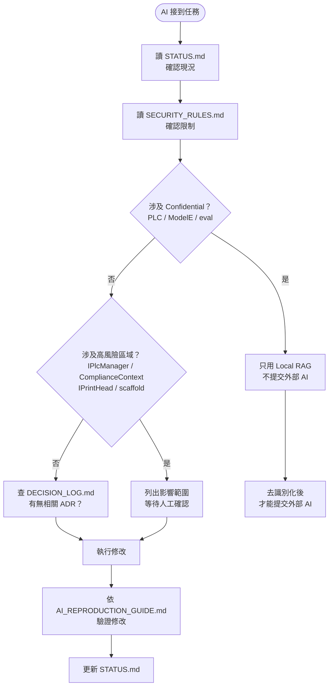
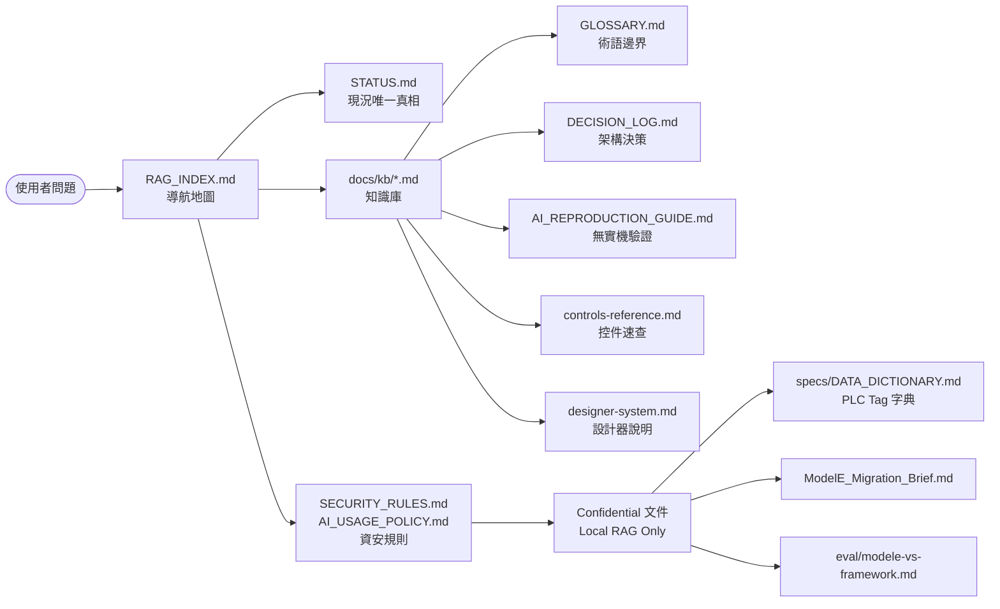

# RAG 文件索引（AI 導航地圖）

> 本文件是給 AI 和 RAG 系統的「找路地圖」。  
> 每個段落對應一類問題場景——RAG 檢索到哪段，就知道該去哪裡找答案。  
> **不是文件清單，是場景→文件的映射。**

---

## 快速分級提醒

| 等級 | 說明 | 可用工具 |
|---|---|---|
| Public | 通用技術問題 | 任意 AI 工具 |
| Internal | 框架內部邏輯 | Claude CLI / Gemini CLI（去識別化後） |
| Confidential | PLC Tag、設備 IP、客戶規格、移植策略 | 僅 Local RAG（Open WebUI），不可外傳 |

AI 行為規則完整版見 `SECURITY_RULES.md`，分級政策見 `AI_USAGE_POLICY.md`。

---

## 場景 1：查目前狀態、下一步、未解問題

**你在問：** 現在在做什麼？有什麼卡住？下一步是什麼？

**讀這個：**
- `STATUS.md` ★ 唯一動態狀態來源

**你會找到：**
- 當前進度與最近 commit
- 進行中任務清單
- 未解問題與優先度
- 高風險區域（哪裡不能亂動）
- 測試狀態（目前全手動，無自動化）

**注意：**
- `STATUS.md` 每次任務後更新，是最即時的來源
- `docs/refactor/PROGRESS.md` 只是 B0–B10 重構歷史，不反映現況
- 若 `STATUS.md` 與其他文件衝突，以 `STATUS.md` 為準

---

## 場景 2：查 AI 行為規則、安全限制、哪些資料不能動

**你在問：** 我能改這個嗎？這個資料能給外部 AI 嗎？修改前要注意什麼？

**讀這個：**
- `CLAUDE.md` — AI 行為規則、優先順序、核心架構禁令
- `SECURITY_RULES.md` — 哪些資料絕對不能外傳、高風險介面清單
- `AI_USAGE_POLICY.md` — L1/L2/L3 資料分級、工具選用對照

**你會找到：**
- 修改優先順序（穩定性 > 正確性 > 最小改動）
- 絕對不能做的事（硬編碼色碼、繞過 ComplianceContext 等）
- 哪些介面改動會導致跨 Repo 編譯失敗
- 什麼情況只能用本機 RAG

---

## 場景 3：查專案架構、模組分層、誰依賴誰

**你在問：** 這個專案的整體結構是什麼？某模組放在哪？專案依賴關係？某術語是什麼意思？

**讀這個：**
- `docs/kb/architecture.md` — Context 系統、資料流、設計哲學
- `docs/kb/GLOSSARY.md` — **專有名詞定義與能力邊界**（什麼是 X、X 能做什麼、X 不能做什麼）
- `docs/PROJECT_MAP.md` — 物理目錄結構、NuGet 版本、跨 Repo 路徑
- `docs/kb/foundation-base-classes.md` — 控件繼承樹（CyberControlBase / PlcControlBase）
- `docs/kb/platform-contracts.md` — 跨 Repo 危險介面（IPlcManager / IPlcMonitor / IPrintHead）

**你會找到：**
- 4 個架構層：工具層 / 框架層 / 核心層 / 硬體層
- Context 靜態管理模式（PlcContext / SecurityContext / ComplianceContext 等）
- JSON 驅動 UI 的完整資料流
- 哪些介面動了會讓整個 Repo 編譯失敗

**注意：**
- 改 `IPlcManager` / `IPlcMonitor` 簽名前必須讀 `platform-contracts.md`
- 跨 Repo 依賴：`../Stackdose.Platform/` 與本 Repo 同層

---

## 場景 4：查「這個需求能不能做到」、架構決策、為什麼不這樣做

**你在問：** 我想加功能 X，架構上能做嗎？為什麼當初不用 DI？為什麼某處不能改？

**讀這個：**
- `docs/kb/DECISION_LOG.md` — 架構決策紀錄（ADR），記錄「能/不能」與原因
- `docs/kb/GLOSSARY.md` — 每個術語的「❌ 不能」欄位，補充 DECISION_LOG 的細節
- `docs/kb/architecture.md` — 設計約束與哲學（補充脈絡）
- `CLAUDE.md` — 核心架構禁令（明確列出不能做的事）

**你會找到：**
- 明確的能力邊界：哪些設計是刻意的、不應被 AI「優化掉」
- 每個決策的原因（避免 AI 反覆提同樣的重構建議）
- 哪些限制來自外部約束（FDA / 跨 Repo / 硬體 SDK）

**使用方式：**
- 若 DECISION_LOG 有明確答案 → 直接引用
- 若沒有記錄 → 從 architecture.md 推斷，並建議補記錄

---

## 場景 5：查 UI 控制項、設計器、Behavior Engine

**你在問：** PlcLabel 有哪些屬性？Spacer 怎麼用？Behavior Engine 怎麼接事件？設計器有什麼功能？

**讀這個：**
- `docs/kb/controls-reference.md` — 所有 42 個 UI 元件職責與屬性速查
- `docs/kb/designer-system.md` — MachinePageDesigner / DesignViewer / DesignRuntime 完整說明
- `docs/kb/behavior-system.md` — JSON events[] schema、6 個 Handler、BehaviorEngine 用法

**你會找到：**
- 每個控制項的 DP 清單、用途、注意事項
- 設計器工作流程（拖曳 → JSON → DesignRuntime 驗證）
- Behavior Engine 的 on/when/do 結構與支援的 action 類型
- RuntimeControlFactory 的控件渲染邏輯

**注意：**
- `PlcDataGridPanel` 不在 UI.Core，在 `Stackdose.App.DeviceFramework/Controls/`
- 設計器顯示 DefaultValue，不連 PLC；DesignRuntime 才連 PLC 顯示即時值

---

## 場景 6：查主題系統、色碼 Token、Dark/Light 切換

**你在問：** 這個控件的顏色為什麼不對？Token 命名規則是什麼？怎麼新增 Token？

**讀這個：**
- `docs/kb/controls-reference.md` 的「主題 Token 規則」段落
- `Stackdose.UI.Core/Themes/DarkColors.xaml` / `LightColors.xaml`（程式碼）

**你會找到：**
- Token 前綴規則：`Surface.*` / `Text.*` / `Action.*` / `Border.*` / `Status.*`
- 禁止事項：控件 XAML 裡不能出現 `#RRGGBB` 硬編碼色碼
- Dark/Light 字典必須同步維護

**注意：**
- Token 命名改動或移除會全域破壞所有控件主題
- 新增 Token 時兩個字典（Dark/Light）都要同步

---

## 場景 7：查快速上手、建新 App、Scaffold 指令

**你在問：** 怎麼建一個新的設備 App？腳本指令是什麼？

**讀這個：**
- `docs/kb/quickstart.md` — 3 步驟快速建立 Shell App（Dashboard / Standard / SinglePage）
- `docs/AI_SCAFFOLDING_GUIDE.md` — AI 輔助 scaffold 的完整說明

**你會找到：**
- `new-app.ps1` 指令與參數
- Dashboard / Standard / SinglePage 三種模式的選擇指南
- 最小必要設定欄位清單
- 單頁設計器版型選項

**注意：**
- 含中文的 `.ps1` 必須存 UTF-8 with BOM，否則 PS5 zh-TW 環境亂碼
- `MyPrintApp2` / `MyPrintApp3` 等現有副本有獨立 `RuntimeControlFactory.cs`，scaffold 修正需個別 rebuild

---

## 場景 8：查重構歷史、B0–B10 架構演進

**你在問：** 某個設計為什麼長這樣？B1 重構做了什麼？某介面是什麼時候加的？

**讀這個：**
- `docs/refactor/PROGRESS.md` — B0–B10 完成紀錄（已全部完成，僅作歷史補充）
- `docs/refactor/HANDOFF.md` — ⚠️ 2026-04-24 已過期，供參考
- `docs/refactor/B0-findings.md` — B0 盤點發現的問題
- `docs/refactor/B0-control-inventory.md` — 控件完整 DP 清單

**注意：**
- 這些是歷史文件。若與 `STATUS.md` 或現有程式碼衝突，以當前程式碼為準
- B0–B10 全部完成，不再更新

---

## 場景 9：查開發日誌、Bug 修正、決策變化記錄

**你在問：** 上週改了什麼？某個 bug 是什麼時候修的？某功能為什麼後來改掉？

**讀這個：**
- `docs/devlog/2026-05.md` — 最新（2026 年 5 月）
- `docs/devlog/2026-04.md` — 2026 年 4 月

**你會找到：**
- 每日 commit 摘要（feat / fix / refactor / chore）
- Bug 修正記錄與根因
- 設計決策的變化脈絡

---

## 場景 10：查 ModelE、設備移植、WinForms vs WPF 差距分析

**你在問：** ModelE 移植進度如何？WinForms 舊功能在新框架怎麼對應？

**讀這個：**
- `docs/ModelE_Migration_Brief.md` — 移植摘要與策略
- `docs/eval/modele-vs-framework.md` — 功能對照與差距分析

**資料等級：Confidential — Local RAG only**

**注意：**
- 這些文件可能含設備控制邏輯、PLC 位址、移植策略
- 不可直接提供給外部 AI（Claude API / ChatGPT）
- 外部 AI 只能接收去識別化摘要

---

## 場景 11：查 PLC Tag、資料字典、位址對應

**你在問：** D100 代表什麼？M10 是什麼 Flag？某 Alarm 位址在哪？

**讀這個：**
- `docs/specs/DATA_DICTIONARY.md` — PLC Tag 字典（含去識別化模板）

**資料等級：Confidential — Local RAG only**

**注意：**
- 真實 PLC Tag 與位址絕對不可提供外部 AI
- 若需外部 AI 協助分析邏輯，使用 DATA_DICTIONARY.md 底部的「去識別化模板」格式描述

---

## 場景 12：AI 修改後如何在無實機環境驗證

**你在問：** 我改了 X，沒有 PLC / 噴頭硬體，怎麼確認改對了？哪些東西可以自動測試？

**讀這個：**
- `docs/kb/AI_REPRODUCTION_GUIDE.md` — 無實機環境驗證步驟、可自動化測試項目清單

**你會找到：**
- DesignRuntime 離線啟動步驟（不需要 PLC）
- 各類修改對應的驗證方法（主題、工廠、JSON schema、Behavior Engine）
- AI 修改後的標準檢查清單（7 個必確認項）
- 哪些項目不適合自動化，只能手動驗證

---

---

## 知識關係圖（Mermaid）

### 圖一：AI 開發流程圖



---

### 圖二：RAG 文件關係圖



---

### 圖三：資料分級與工具使用流程圖

```mermaid
flowchart TD
    Data([資料] ) --> L1{等級判斷}
    L1 -->|Public\n通用技術說明| AnyAI[任意 AI 工具\nClaude / ChatGPT / Gemini]
    L1 -->|Internal\n專案架構 / 開發流程| ClaudeOK[Claude CLI\nGemini CLI\n去識別化後可用外部 AI]
    L1 -->|Confidential\nPLC / ModelE / 客戶資料| LocalOnly[Local RAG Only\nOpen WebUI 本機部署]

    LocalOnly --> NeedExternal{需要外部 AI 協助？}
    NeedExternal -->|是| Anonymize[去識別化\n替換 PLC 位址 / 設備型號\n移除客戶資訊]
    Anonymize --> ClaudeOK
    NeedExternal -->|否| Done([完成])
    ClaudeOK --> Done
    AnyAI --> Done
```

---

## 快速場景對照表

| 你的問題類型 | 優先讀 |
|---|---|
| 現在在做什麼？ | `STATUS.md` |
| 這個能改嗎？ | `SECURITY_RULES.md` → `CLAUDE.md` |
| 這個需求能做到嗎？ | `docs/kb/DECISION_LOG.md` → `docs/kb/architecture.md` |
| X 是什麼 / X 能做什麼？ | `docs/kb/GLOSSARY.md` |
| 某控件怎麼用？ | `docs/kb/controls-reference.md` |
| 設計器怎麼操作？ | `docs/kb/designer-system.md` |
| Behavior Engine 怎麼設定？ | `docs/kb/behavior-system.md` |
| 怎麼建新 App？ | `docs/kb/quickstart.md` |
| 顏色 Token 怎麼用？ | `docs/kb/controls-reference.md` 主題 Token 段落 |
| 某介面能改簽名嗎？ | `docs/kb/platform-contracts.md` |
| 舊重構做了什麼？ | `docs/refactor/PROGRESS.md` |
| ModelE / 設備移植？ | `docs/ModelE_Migration_Brief.md`（Confidential） |
| PLC Tag 對應？ | `docs/specs/DATA_DICTIONARY.md`（Confidential） |
| 修改後怎麼驗證？ | `docs/kb/AI_REPRODUCTION_GUIDE.md` |
